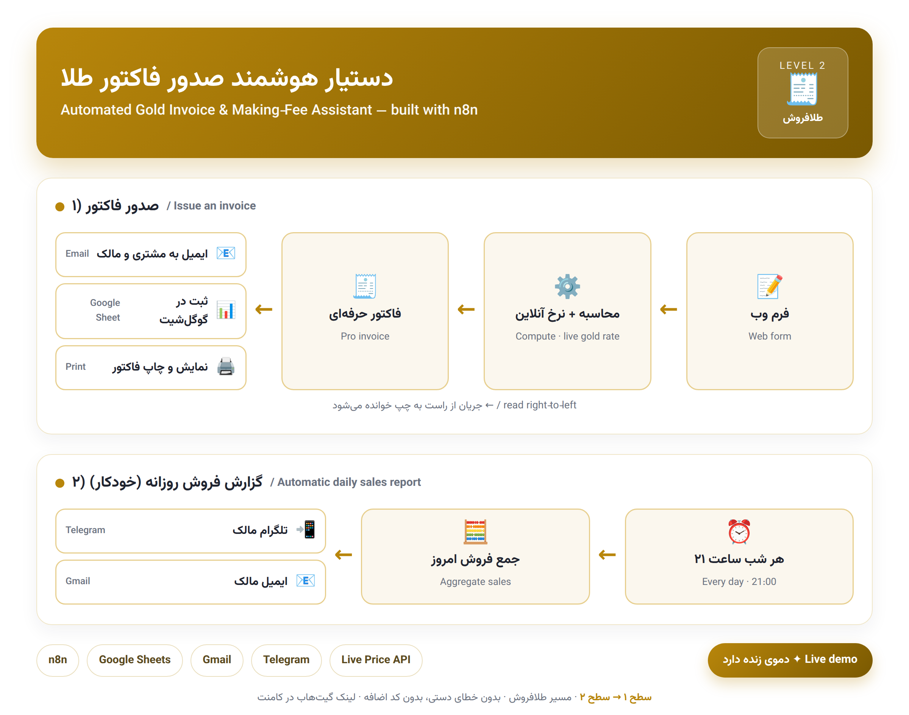
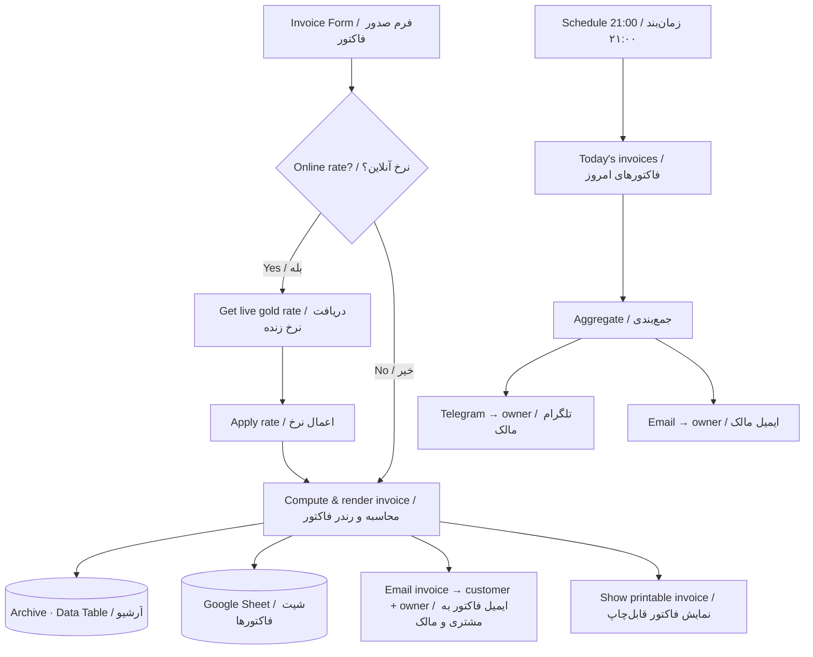

# 🧾 Gold Invoice & Making-Fee Assistant — Level 2 | دستیار محاسبه‌ی فاکتور و اجرت — سطح ۲

> **Goldsmith track · Level 2** — the continuation of **[Level 1: Live Gold/Coin/Dollar Price Bot](../level1-live-gold-price-bot)**.
> After the shop automates live prices (Level 1), this Level 2 assistant automates **issuing invoices**.
>
> **مسیر طلافروش · سطح ۲** — ادامه‌ی **[سطح ۱: ربات قیمت لحظه‌ای طلا، سکه و دلار](../level1-live-gold-price-bot)**.
> بعد از خودکارسازی قیمت‌ها (سطح ۱)، این دستیارِ سطح ۲ **صدور فاکتور** را خودکار می‌کند.

`#n8n` `#invoice` `#gold` `#goldsmith` `#فاکتور_طلا` `#اجرت` `#محاسبه_طلا` `#طلافروش` `#automation` `#اتوماسیون` `#webform` `#فرم_آنلاین` `#google_sheets` `#gmail` `#iran` `#level2`

> 🔒 **The workflow file is private.** This public page shows only the **schematic + docs**. The importable workflow (`workflow.json`) is the product and is kept out of the public repo.
> 🔒 **فایل ورک‌فلو خصوصی است.** این صفحه‌ی عمومی فقط **شماتیک و مستندات** را نشان می‌دهد؛ فایل قابل‌ایمپورت (`workflow.json`) خودِ محصول است و در ریپوی عمومی قرار نمی‌گیرد.

---

## 🗺️ Workflow Schematic | شماتیک ورک‌فلو

---

## 🇬🇧 English

### What it does
- **Web form** (public URL) — enter item, weight, karat, making-fee %, profit %, customer email/phone.
- **Gold rate** — fetched **online** (nerkh.io) or entered manually, chosen from a form dropdown.
- **Compute** — `goldValue = weight × rate × (karat/750)`, then making-fee, profit, total.
- **Professional invoice** — styled, printable, with an editable shop/logo header.
- **Archive** — every invoice → n8n Data Table **and** a Google Sheet.
- **Email** — invoice sent to the customer, with a copy to the owner; the HTML invoice file is attached.
- **Daily report (21:00)** — today's totals → owner's **Telegram and Gmail**.

### Why a shop pays
Manual calculation errors in gold mean direct money loss. This removes them and issues a consistent invoice every time — and its public form doubles as a **live demo** buyers can test before buying.

### Tech
n8n · Form Trigger · nerkh.io price API · Data Table · Google Sheets · Gmail · Telegram.

---

## 🇮🇷 فارسی

### چه‌کار می‌کند؟
- **فرم وب** (لینک عمومی) — شرح کالا، وزن، عیار، درصد اجرت و سود، ایمیل/شماره‌ی مشتری.
- **نرخ طلا** — از فرم انتخاب می‌شود: **آنلاین** (nerkh.io) یا دستی.
- **محاسبه** — `ارزش طلا = وزن × نرخ × (عیار÷۷۵۰)` + اجرت + سود = مبلغ نهایی.
- **فاکتور حرفه‌ای** — زیبا، قابل‌چاپ، با هدر لوگو/نام فروشگاهِ قابل‌ویرایش.
- **آرشیو** — هر فاکتور → Data Table **و** Google Sheet.
- **ایمیل** — فاکتور به مشتری با نسخه‌ای برای مالک؛ فایل HTML فاکتور پیوست می‌شود.
- **گزارش روزانه (۲۱)** — جمع فروش امروز → **تلگرام و جیمیل مالک**.

### چرا مغازه‌دار پول می‌دهد؟
خطای محاسبه‌ی دستی در طلا یعنی ضرر مستقیم. این ابزار آن را حذف می‌کند و فاکتور یک‌دست می‌دهد؛ ضمناً لینک عمومی فرم، **دموی زنده** برای تست خریدار است.

---

## 📂 Public files | فایل‌های عمومی

| File | توضیح |
|---|---|
| `README.md` | همین صفحه (شماتیک + توضیح) / this page (schematic + overview) |
| `docs/setup.md` | راهنمای راه‌اندازی / setup guide |
| `docs/sales.md` | راهنمای فروش / sales guide |
| `workflow.json` 🔒 | خصوصی — در ریپو نیست / private — not in the repo |

---

Goldsmith track · **Level 1 → Level 2** · مسیر طلافروش
Part of **36 money-making n8n + Claude automation projects for Iran**

`#n8n_iran` `#طلافروش` `#فاکتور` `#invoice_automation` `#fintech` `#claude`

