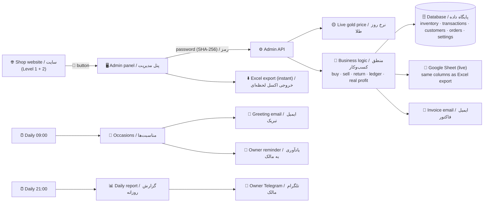

# 🏦 Gold Shop Management System — Level 3 | سیستم مدیریت طلافروشی — سطح ۳

> **Goldsmith track · Level 3 (Advanced)** — builds on **[Level 1: Live Price Bot](../level1-live-gold-price-bot)** and **[Level 2: Invoice Assistant](../level2-invoice-and-fee-assistant)**.
> **مسیر طلافروش · سطح ۳ (پیشرفته)** — ادامه‌ی **[سطح ۱: ربات قیمت لحظه‌ای](../level1-live-gold-price-bot)** و **[سطح ۲: دستیار فاکتور](../level2-invoice-and-fee-assistant)**.

`#n8n` `#gold_shop` `#inventory_management` `#real_profit` `#erp` `#admin_panel` `#google_sheets` `#excel` `#melted_gold` `#gold_coins` `#installments` `#barcode` `#سیستم_مدیریت_طلافروشی` `#مدیریت_موجودی` `#سود_واقعی` `#حساب_همکار` `#آبشده` `#مظنه` `#سکه` `#فروش_اقساطی` `#طلافروش` `#حسابداری_طلا` `#اتوماسیون` `#iran` `#level3`

> 🔗 **Shop website | سایت فروشگاه:** **https://n8n.aifardainstitute.ir/webhook/gold-shop** → button **«🔐 پنل مدیریت فروشگاه»**
> 🔗 **Admin panel | پنل مدیریت:** **https://n8n.aifardainstitute.ir/webhook/gold-admin** (password-protected · با رمز ورود؛ رمز را خود مدیر در «تنظیمات» عوض می‌کند)
>
> 🔒 **The workflow file is private.** This page shows the schematic, screenshots and docs only.
> 🔒 **فایل ورک‌فلو خصوصی است.** این صفحه فقط شماتیک، تصاویر و مستندات را نشان می‌دهد.

---

## 🗺️ Schematic | شماتیک

| 📊 Dashboard / داشبورد | 🧾 Multi-item invoice / فاکتور چندقلمی |
|---|---|
|  |  |
| 👥 **Customer & supplier accounts / حساب مشتری و همکار** | 💵 **Cash box & expenses / صندوق و هزینه** |
|  |  |
| 📦 **Inventory by weight & karat / موجودی به تفکیک عیار** | 📈 **Financial report / گزارش مالی** |
|  |  |
| 🧈 **Melted gold (by mazaneh) & melting / آبشده و ذوب** | 🪙 **Coins: stock, avg cost, bubble / سکه** |
|  |  |
| 🏷️ **Barcode labels / اتیکت بارکددار** | |
|  | |

Screenshots use sample test data. / تصاویر با داده‌ی آزمایشی گرفته شده‌اند.

---

## 🇬🇧 English

### What it does
- **Inventory by weight & karat** — every piece stored with weight, karat (750/740/705/900/995/585), 18K-equivalent grams, *mesghal*, purchase rate and making cost; grouped per karat; search & category filters.
- **Purchases** — from suppliers (cash, credit, or **gold-for-gold settlement** that records the debt in grams), batch entry of identical pieces, and **buy-back of used gold** from customers with melt-loss deduction.
- **Multi-item invoices** — fee % + profit % or a fixed agreed price, discount, VAT on fee & profit only, **trade-in of old gold**, payment method (cash / POS / card-to-card / cheque / mixed), partial payment → automatic customer credit; printable invoice + email to the customer.
- **Returns & corrections** — sales returns (refund is reduced by any open customer debt), voiding mistaken entries.
- **Customer & supplier ledger** — money balance and **gold balance in grams** for every party; receive / pay in cash or in gold.
- **Melted gold (آبشده)** — buy/sell by **mazaneh** (live or manual) per mesghal of 705 with a per-mesghal commission, lab assay and certificate number; **melt used gold into a bar** with the melt loss recorded in grams and the cost carried over.
- **Coins** — Emami, Bahar Azadi, half, quarter, gram coins: stock by count, moving-average cost, live price and bubble, real profit per sale, voidable trades.
- **Installment sales** — split any credit balance into N installments (Jalali due dates); due/overdue list on the dashboard and a 09:00 Telegram reminder; one-click installment receipt.
- **Stones & per-gram making fee** — stone/gem cost per piece (added to cost and sale price); making fee as % or toman per gram.
- **Barcode labels & scanner** — printable CODE128 tags (shop, title, weight, karat); a USB scanner types the code into the sale form and the piece drops into the cart.
- **Live price board** — 18K, 740, 24K, used gold, mazaneh, melted-cash/wholesale, every coin with its bubble, silver 925, ounce, USD, EUR.
- **Custom orders & repairs** — deposit, due date, status workflow.
- **Cash box & expenses** — daily/monthly in-out per payment method; rent, wages, bills …
- **Real profit, including price swings** — each sale is split into:
  - **Operating profit** = sale price − gold value at sale-day rate − making cost paid
  - **Holding gain/loss** = gold weight × (sale-day rate − purchase-day rate)
  - **Real profit** = operating profit + holding gain = sale price − full cost basis (also in grams of gold)
  - **Net profit** = real profit − expenses (VAT is never counted as profit)
- **Occasion messages** — birthdays & anniversaries (Jalali): greeting emails at 09:00 + Telegram reminder for the owner.
- **Live Google Sheet + instant Excel export** — every write is mirrored to a Google Sheet; the Excel button downloads the same tabs and the same Persian column headers (RTL), plus a summary sheet.
- **Owner-set password** — the owner sets and changes the panel password in *Settings*; only a salted SHA-256 hash is stored.

### Why a shop pays
Inventory control and *real* profit are exactly what goldsmiths never know precisely — gold-price swings hide whether the shop earned from selling or just from the market moving. This system separates the two and keeps every customer's and supplier's money **and gold** balance straight.

### Tech
n8n (webhooks + schedules) · n8n Data Tables (database) · single-page admin panel served by n8n · Google Sheets · SheetJS (Excel) · free live price feed · Gmail · Telegram.

---

## 🇮🇷 فارسی

### چه‌کار می‌کند؟
- **موجودی به تفکیک وزن و عیار** — هر قطعه با وزن، عیار (۷۵۰/۷۴۰/۷۰۵/۹۰۰/۹۹۵/۵۸۵)، معادل ۱۸ عیار، مثقال، نرخ خرید و اجرت پرداختی؛ جمع به تفکیک عیار؛ جستجو و فیلتر دسته.
- **خرید** — از همکار/تولیدی (نقد، نسیه، یا **طلایی = بدهی به گرم**)، ثبت چند قلم یکسان با هم، و **خرید طلای کهنه** از مشتری با کسر افت.
- **فاکتور فروش چندقلمی** — درصد اجرت و سود یا مبلغ توافقی، تخفیف، مالیات ارزش افزوده (فقط روی اجرت و سود)، **تعویض طلای کهنه**، روش پرداخت (نقد/کارتخوان/کارت‌به‌کارت/چک/ترکیبی)، پرداخت ناقص ← نسیه‌ی خودکار؛ چاپ فاکتور و ایمیل به مشتری.
- **برگشت از فروش و ابطال** — مبلغ استرداد با بدهی مشتری تهاتر می‌شود؛ ابطال ثبت‌های اشتباه.
- **حساب مشتری و همکار** — مانده‌ی ریالی و **مانده‌ی طلایی (گرم)**؛ دریافت/پرداخت نقدی یا طلایی.
- **🧈 آبشده** — خرید و فروش با **مظنه** (روز یا دستی) به‌ازای مثقال ۷۰۵ با کارمزد هر مثقال، عیار آزمایشگاه و شماره‌ی ری‌گیری؛ **ذوب طلای کهنه و تبدیل به آبشده** با ثبت افت (گرم) و انتقال بهای تمام‌شده.
- **🪙 سکه** — امامی، بهار آزادی، نیم، ربع، گرمی: موجودی تعدادی، میانگین بهای خرید، قیمت روز و حباب، سود واقعی هر فروش، امکان ابطال.
- **📅 فروش اقساطی** — تقسیط مانده‌ی نسیه به چند قسط با سررسید شمسی؛ فهرست سررسیده/معوق در داشبورد و یادآوری تلگرامی ساعت ۹؛ دریافت قسط با یک کلیک.
- **💎 سنگ و اجرت گرمی** — قیمت سنگ/نگین هر قطعه (در بها و قیمت فروش)؛ اجرت درصدی یا تومان برای هر گرم.
- **🏷️ اتیکت بارکددار و بارکدخوان** — چاپ اتیکت با نام مغازه، عنوان، وزن و عیار؛ با بارکدخوان، کالا مستقیم وارد فاکتور می‌شود.
- **📋 تابلوی نرخ** — ۱۸ عیار، ۷۴۰، ۲۴ عیار، دست‌دوم، مظنه، آبشده نقدی/بنکداری، همه‌ی سکه‌ها با حباب، نقره ۹۲۵، انس، دلار، یورو.
- **سفارش ساخت و تعمیر** — بیعانه، تاریخ تحویل، وضعیت.
- **صندوق و هزینه‌ها** — ورودی/خروجی روزانه و ماهانه به تفکیک روش پرداخت؛ اجاره، حقوق، قبوض و …
- **سود واقعی با احتساب نوسان قیمت**:
  - **سود فروش** = مبلغ فروش − ارزش طلای کالا به نرخ روز فروش − اجرت پرداختی
  - **سود/زیان نوسان** = وزن طلا × (نرخ روز فروش − نرخ روز خرید)
  - **سود واقعی** = سود فروش + نوسان = مبلغ فروش − بهای تمام‌شده (به گرم طلا هم)
  - **سود خالص** = سود واقعی − هزینه‌ها (مالیات ارزش افزوده جزو سود نیست)
- **پیام در مناسبت‌ها** — تولد و سالگرد ازدواج (شمسی): ایمیل تبریک ساعت ۹ صبح + یادآوری تلگرامی به مالک.
- **گوگل‌شیت زنده + خروجی اکسل لحظه‌ای** — هر ثبت هم‌زمان در گوگل‌شیت نوشته می‌شود؛ دکمه‌ی «خروجی اکسل» همان تب‌ها و **همان ستون‌های فارسی** (راست‌به‌چپ) را به‌علاوه‌ی برگه‌ی خلاصه‌ی گزارش دانلود می‌کند.
- **رمز به انتخاب مدیر** — مدیر رمز پنل را در «تنظیمات» می‌گذارد و هر وقت بخواهد عوض می‌کند؛ فقط هش رمز (SHA-256 با نمک) ذخیره می‌شود.

### «مشتری قبلی / مشتری جدید / مشتری گذری» یعنی چه؟
- **مشتری قبلی**: از فهرست انتخاب کنید؛ فروش به حساب او ثبت می‌شود (نسیه، سابقه، مناسبت‌ها).
- **مشتری جدید**: نام و تلفن را همان‌جا بنویسید؛ هم مشتری ساخته می‌شود و هم فروش ثبت می‌شود.
- **مشتری گذری (بی‌نام)**: کسی که نمی‌خواهید ثبتش کنید؛ فقط وقتی مجاز است که کامل پرداخت کند.

### چرا مغازه‌دار پول می‌دهد؟
کنترل موجودی و **سود واقعی** دقیقاً همان چیزی است که طلافروش‌ها هیچ‌وقت دقیق نمی‌دانند؛ نوسان قیمت طلا پنهان می‌کند که سود از «فروش» آمده یا فقط از «گران شدن طلا». این سیستم این دو را جدا می‌کند و حساب ریالی **و طلایی** هر مشتری و همکار را دقیق نگه می‌دارد.

### ابزارها
n8n (وب‌هوک + زمان‌بند) · Data Table داخلی n8n (پایگاه داده) · پنل مدیریتی تک‌صفحه‌ای · گوگل‌شیت · SheetJS (اکسل) · منبع قیمت رایگان · Gmail · تلگرام.

---

## 📂 Files | فایل‌ها

| File | توضیح |
|---|---|
| `README.md` | همین صفحه / this page |
| `docs/setup.md` | راهنمای راه‌اندازی / setup guide |
| `docs/sales.md` | راهنمای فروش / sales guide |
| `docs/screenshots/` | تصاویر پنل / panel screenshots |
| `workflow.json` 🔒 | خصوصی — در ریپو نیست / private — not in the repo |

---

Goldsmith track · **Level 1 → Level 2 → Level 3** · مسیر طلافروش

`#n8n_iran` `#طلافروش` `#سیستم_مدیریت` `#gold_erp` `#fintech` `#claude`

