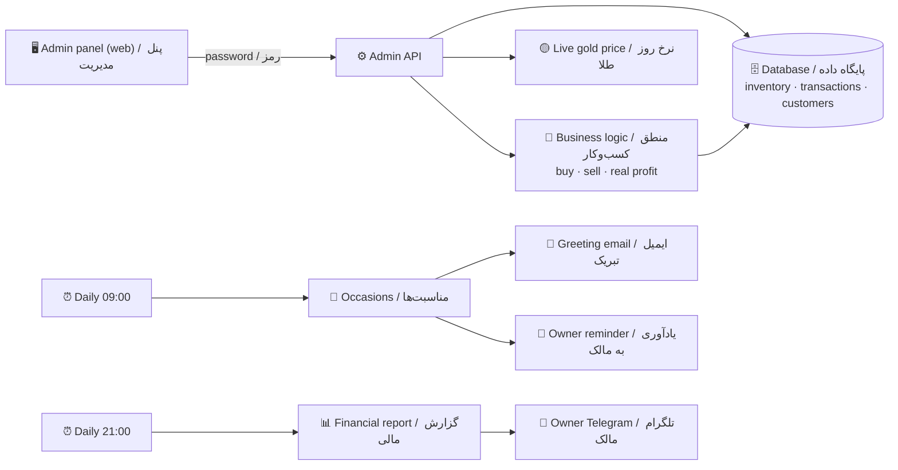
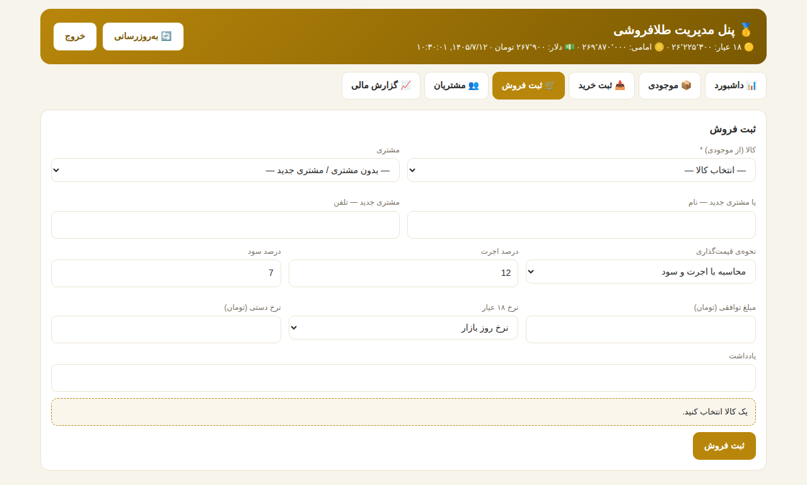

# 🏦 Gold Shop Management System — Level 3 | سیستم مدیریت طلافروشی — سطح ۳

> **Goldsmith track · Level 3 (Advanced)** — builds on **[Level 1: Live Price Bot](../level1-live-gold-price-bot)** and **[Level 2: Invoice Assistant](../level2-invoice-and-fee-assistant)**.
> **مسیر طلافروش · سطح ۳ (پیشرفته)** — ادامه‌ی **[سطح ۱: ربات قیمت لحظه‌ای](../level1-live-gold-price-bot)** و **[سطح ۲: دستیار فاکتور](../level2-invoice-and-fee-assistant)**.

`#n8n` `#gold_shop` `#inventory_management` `#real_profit` `#erp` `#admin_panel` `#سیستم_مدیریت_طلافروشی` `#مدیریت_موجودی` `#سود_واقعی` `#طلافروش` `#حسابداری_طلا` `#اتوماسیون` `#iran` `#level3`

> 🔗 **Live admin panel | پنل زنده:** **https://n8n.aifardainstitute.ir/webhook/gold-admin** (password-protected · با رمز ورود)
>
> 🔒 **The workflow file is private.** This page shows the schematic, screenshots and docs only.
> 🔒 **فایل ورک‌فلو خصوصی است.** این صفحه فقط شماتیک، تصاویر و مستندات را نشان می‌دهد.

---

## 🗺️ Schematic | شماتیک

| 📊 Dashboard / داشبورد | 📈 Financial report / گزارش مالی |
|---|---|
|  |  |
| 📦 **Inventory by weight & karat / موجودی به تفکیک عیار** | 🛒 **Sale with live profit preview / فروش با پیش‌نمایش سود** |
|  |  |

Screenshots use sample test data. / تصاویر با داده‌ی آزمایشی گرفته شده‌اند.

---

## 🇬🇧 English

### What it does
- **Inventory by weight & karat** — every piece is stored with weight, karat (750/740/900/995/585), 18K-equivalent grams, purchase rate and making cost; grouped view per karat.
- **Buy & sell records** — purchases enter stock at the live (or manual) 18K rate; sales are priced with making-fee % + profit % or a fixed amount.
- **Real profit, including price swings** — each sale is split into:
  - **Operating profit** = sale price − gold value at sale-day rate − making cost paid
  - **Holding gain/loss** = gold weight × (sale-day rate − purchase-day rate)
  - **Real profit** = operating profit + holding gain = sale price − full cost basis (also shown in grams of gold)
- **Customer tracking** — purchase history, total spend, birthday & wedding-anniversary dates (Jalali).
- **Occasion messages** — every morning at 09:00, greeting emails go to customers and the owner gets a Telegram reminder to call them.
- **Financial reports** — today / this month / last month / this year / all; unrealized gain on stock; CSV export; nightly 21:00 report to the owner's Telegram.

### Why a shop pays
Inventory control and *real* profit are exactly what goldsmiths never know precisely — gold-price swings hide whether the shop earned from selling or just from the market moving. This system separates the two.

### Tech
n8n (webhooks + schedules) · n8n Data Tables (database) · single-page admin panel served by n8n · free live price feed · Gmail · Telegram.

---

## 🇮🇷 فارسی

### چه‌کار می‌کند؟
- **مدیریت موجودی به تفکیک وزن و عیار** — هر قطعه با وزن، عیار (۷۵۰/۷۴۰/۹۰۰/۹۹۵/۵۸۵)، معادل ۱۸ عیار، نرخ خرید و اجرت پرداختی ثبت می‌شود؛ جمع موجودی به تفکیک عیار.
- **ثبت خرید و فروش** — خرید با نرخ روز (یا دستی) وارد موجودی می‌شود؛ فروش با درصد اجرت و سود یا مبلغ توافقی.
- **سود واقعی با احتساب نوسان قیمت** — هر فروش به دو جزء تفکیک می‌شود:
  - **سود فروش** = مبلغ فروش − ارزش طلای کالا به نرخ روز فروش − اجرت پرداختی
  - **سود/زیان نوسان** = وزن طلا × (نرخ روز فروش − نرخ روز خرید)
  - **سود واقعی** = سود فروش + نوسان = مبلغ فروش − بهای تمام‌شده (به گرم طلا هم نمایش داده می‌شود)
- **پیگیری مشتریان** — سابقه‌ی خرید، جمع خرید، تاریخ تولد و سالگرد ازدواج (شمسی).
- **پیام در مناسبت‌ها** — هر روز ساعت ۹ صبح، ایمیل تبریک برای مشتری و یادآوری تلگرامی برای مالک.
- **گزارش مالی** — امروز / این ماه / ماه قبل / امسال / همه؛ سود تحقق‌نیافته‌ی موجودی؛ خروجی اکسل؛ گزارش شبانه ساعت ۲۱ به تلگرام مالک.

### چرا مغازه‌دار پول می‌دهد؟
کنترل موجودی و **سود واقعی** دقیقاً همان چیزی است که طلافروش‌ها هیچ‌وقت دقیق نمی‌دانند؛ نوسان قیمت طلا پنهان می‌کند که سود از «فروش» آمده یا فقط از «گران شدن طلا». این سیستم این دو را جدا می‌کند.

### ابزارها
n8n (وب‌هوک + زمان‌بند) · Data Table داخلی n8n (پایگاه داده) · پنل مدیریتی تک‌صفحه‌ای · منبع قیمت رایگان · Gmail · تلگرام.

---

## 📂 Files | فایل‌ها

| File | توضیح |
|---|---|
| `README.md` | همین صفحه / this page |
| `docs/setup.md` | راهنمای راه‌اندازی / setup guide |
| `docs/sales.md` | راهنمای فروش / sales guide |
| `docs/screenshots/` | تصاویر پنل / panel screenshots |
| `workflow.json` 🔒 | خصوصی — در ریپو نیست / private — not in the repo |

---

Goldsmith track · **Level 1 → Level 2 → Level 3** · مسیر طلافروش

`#n8n_iran` `#طلافروش` `#سیستم_مدیریت` `#gold_erp` `#fintech` `#claude`

